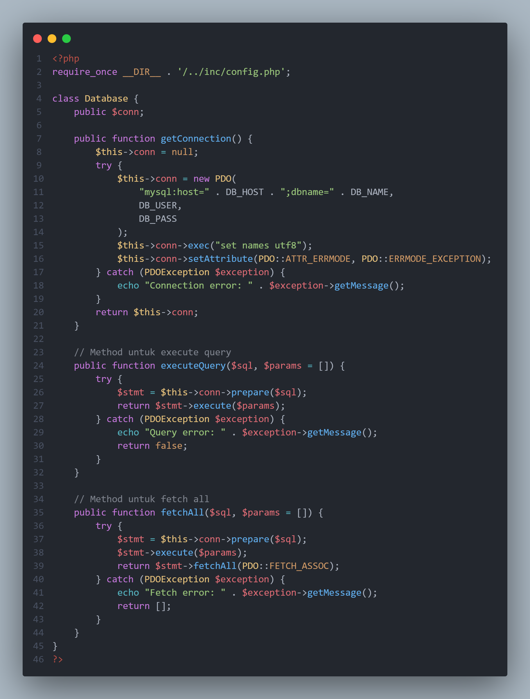
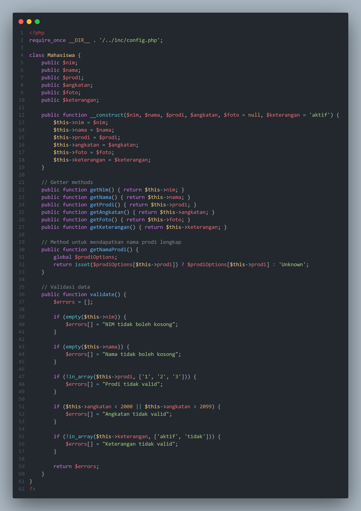
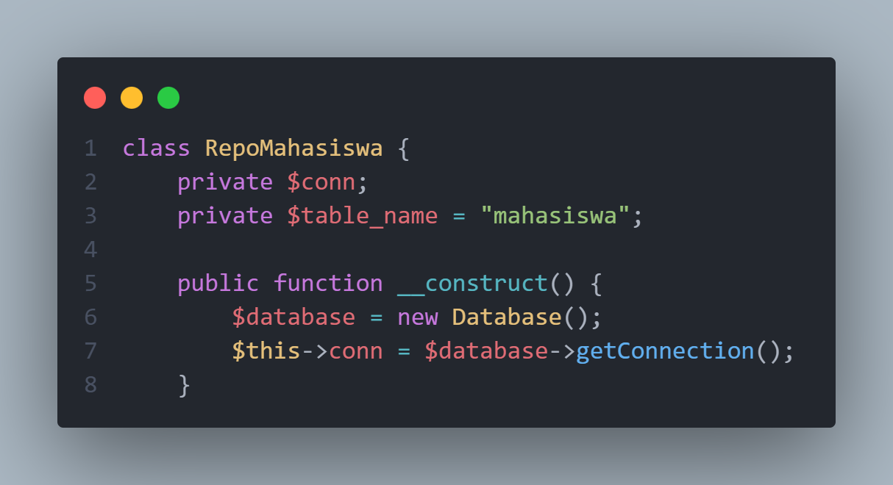
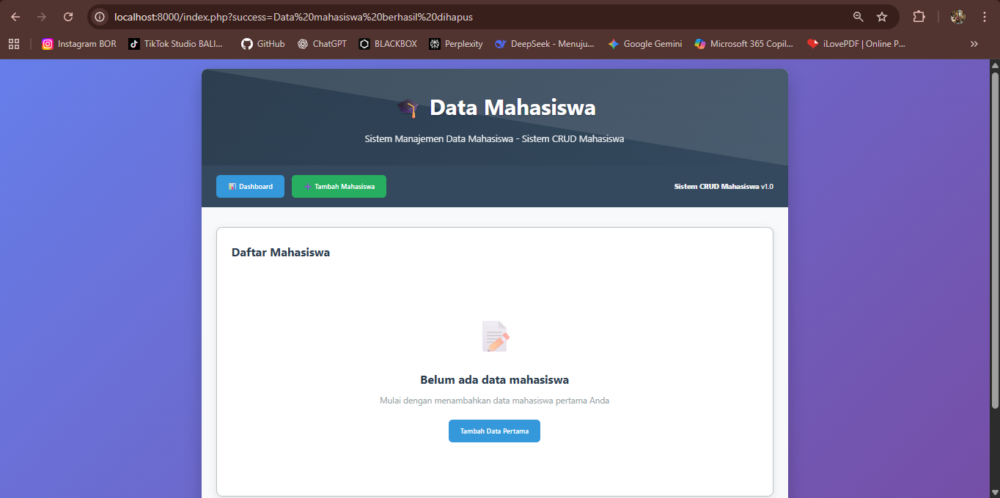
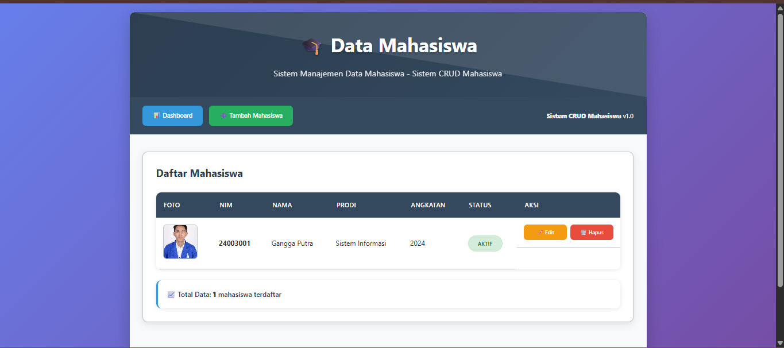
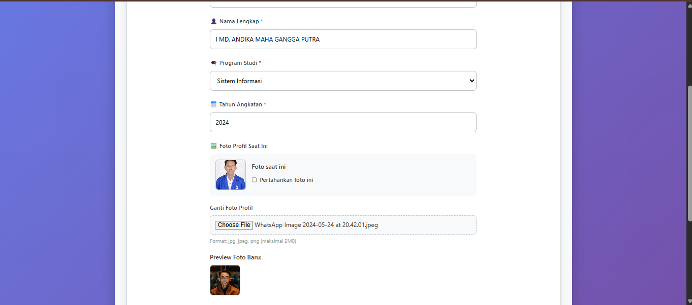
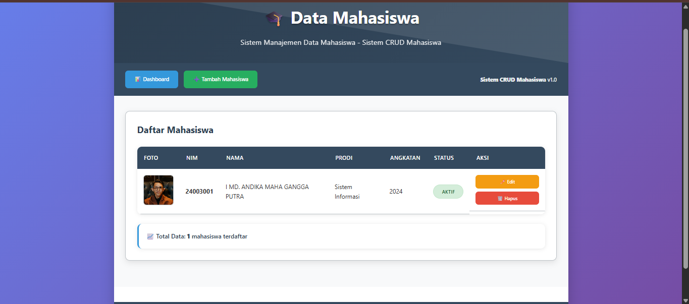
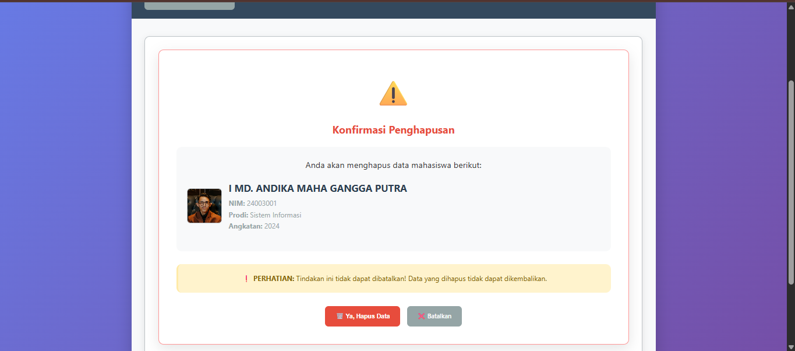
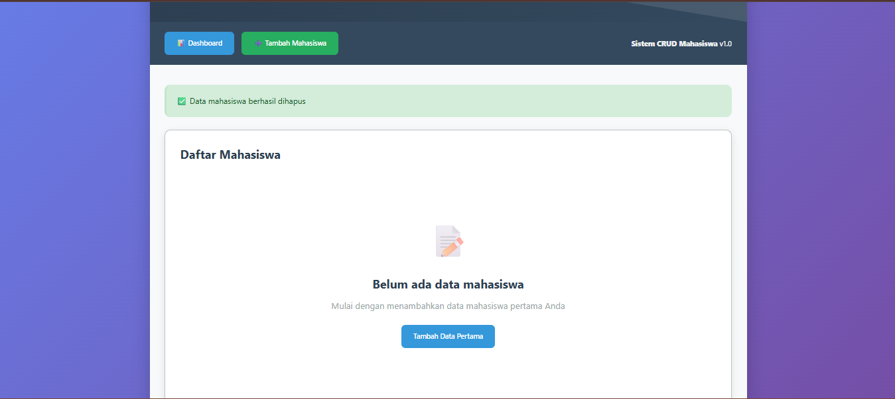

# Aplikasi CRUD Mahasiswa

## 1. Deskripsi Aplikasi

### Entitas yang Dipilih
Aplikasi ini menggunakan entitas **Mahasiswa** dengan atribut:
- NIM (Primary Key)
- Nama
- Prodi (Sistem Komputer, Teknologi Komputer, Sistem Informasi)
- Angkatan (tahun)
- Foto (file gambar)
- Keterangan (aktif/tidak)

### Penjelasan Singkat Fungsi Aplikasi
Aplikasi ini merupakan sistem back-end sederhana untuk mengelola data mahasiswa. Fungsi yang tersedia meliputi:
- **Create**: Menambah data mahasiswa baru.
- **Read**: Menampilkan daftar mahasiswa.
- **Update**: Mengubah data mahasiswa yang sudah ada.
- **Delete**: Menghapus data mahasiswa.

## 2. Spesifikasi Teknis

### Versi yang Digunakan
- PHP: PHP 8.2.12
- DBMS: MySQL Workbench

# Struktur Folder
### Penjelasan Detail Struktur:
#### 📁 `/class/` - Directory Kelas Aplikasi
- **`database.php`** - Kelas untuk mengelola koneksi database menggunakan PDO
- **`mahasiswaEntity.php`** - Kelas entitas yang merepresentasikan data mahasiswa
- **`repoMahasiswa.php`** - Kelas repository untuk operasi CRUD ke database

#### 📁 `/image/` - Directory Gambar
- untuk memnyimpan beberapa file gambar yang saya tampilkan di README.md

#### 📁 `/inc/` - Directory Konfigurasi
- **`config.php`** - File konfigurasi database, path upload, dan setting aplikasi

#### 📁 `/public/` - Directory Public (Web Root)
- **`/css/style.css`** - File stylesheet dengan design modern dan responsive
- **`/uploads/`** - Directory untuk menyimpan file foto yang diupload (otomatis terbuat)
- **`index.php`** - Halaman utama menampilkan daftar mahasiswa
- **`create.php`** - Form untuk menambah data mahasiswa baru
- **`update.php`** - Form untuk mengedit data mahasiswa existing
- **`delete.php`** - Halaman konfirmasi penghapusan data

#### 📄 File Root
- **`readme.md`** - Dokumentasi lengkap aplikasi
- **`schema.sql`** - Skema database untuk import ke MySQL


### Penjelasan Class Utama 
## 📁 Class Database (`database.php`)

## 🎯 **Tujuan Utama**
Class ini bertanggung jawab untuk mengelola koneksi database dan menyediakan method dasar untuk eksekusi query.

## 🔧 **Konstruktor & Inisialisasi**



## 📋 **Method Utama**

### `getConnection()`
- **Fungsi**: Membuat koneksi ke database MySQL menggunakan PDO
- **Fitur**:
  - Menggunakan konfigurasi dari `config.php`
  - Set charset UTF-8 untuk support karakter internasional
  - Error mode di-set ke exception untuk debugging yang lebih baik
  - Error handling dengan try-catch block

### `executeQuery($sql, $params = [])`
- **Fungsi**: Menjalankan query SQL dengan parameter binding
- **Parameter**:
  - `$sql`: Query SQL yang akan dijalankan
  - `$params`: Array parameter untuk prepared statement
- **Return**: Boolean (true jika sukses, false jika gagal)

### `fetchAll($sql, $params = [])`
- **Fungsi**: Menjalankan query dan mengembalikan semua hasil
- **Return**: Array asosiatif dengan data hasil query
- **Error Handling**: Mengembalikan array kosong jika terjadi error

## 🛡️ **Keamanan**
- Menggunakan **PDO Prepared Statements** untuk mencegah SQL injection
- Exception handling yang robust

## 📁 Class Mahasiswa Entity (`mahasiswaEntity.php`)

### 🎯 **Tujuan Utama**
Merepresentasikan entitas Mahasiswa dalam bentuk object dan menangani validasi data.

## 🏗️ **Code**


## 📋 **Method Utama**

### **Getter Methods**
- `getNim()`, `getNama()`, `getProdi()`, `getAngkatan()`, `getFoto()`, `getKeterangan()`
- **Prinsip**: Encapsulation - akses data melalui method

### `getNamaProdi()`
- **Fungsi**: Mengonversi kode prodi menjadi nama lengkap
- **Mapping**:
  - '1' → 'Sistem Komputer'
  - '2' → 'Teknologi Komputer'
  - '3' → 'Sistem Informasi'

### `validate()` - ⚡ **CORE VALIDATION**
```php
public function validate() {
    $errors = [];
    // Validasi NIM (required)
    if (empty($this->nim)) {
        $errors[] = "NIM tidak boleh kosong";
    }
    // Validasi Nama (required)
    if (empty($this->nama)) {
        $errors[] = "Nama tidak boleh kosong";
    }
    // Validasi Prodi (harus 1,2,3)
    if (!in_array($this->prodi, ['1', '2', '3'])) {
        $errors[] = "Prodi tidak valid";
    }
    // Validasi Angkatan (range 2000-2099)
    if ($this->angkatan < 2000 || $this->angkatan > 2099) {
        $errors[] = "Angkatan tidak valid";
    }
    // Validasi Status (harus aktif/tidak)
    if (!in_array($this->keterangan, ['aktif', 'tidak'])) {
        $errors[] = "Keterangan tidak valid";
    }
    return $errors;
}
```

### 🛡️ Business Rules
- **Nim** : Required, format bebas (divalidasi di form)
- **Nama** : Required
- **Prodi** : Harus salah dari 3 pilihan yang ditentukan
- **Tahun** : Tahun antara 2000-2099
- **Status** : Hanya 'aktif' atau 'tidak'

# 📁 Class RepoMahasiswa (`repoMahasiswa.php`)

## 🎯 **Tujuan Utama**
Menangani semua operasi CRUD (Create, Read, Update, Delete) ke database dan mengelola file foto.

## 🏗️ **Inisialisasi**


# 📋 CRUD Operations


## ✅ CREATE - `create(Mahasiswa $mahasiswa)`

```php
public function create(Mahasiswa $mahasiswa) {
    $errors = $mahasiswa->validate();
    if (!empty($errors)) {
        throw new Exception(implode(", ", $errors));
    }
    
    if ($this->isNimExists($mahasiswa->nim)) {
        throw new Exception("NIM sudah terdaftar");
    }
    
    // Query INSERT dengan parameter binding
    $query = "INSERT INTO " . $this->table_name . " 
              (nim, nama, prodi, angkatan, foto, keterangan) 
              VALUES (:nim, :nama, :prodi, :angkatan, :foto, :keterangan)";
}
```

**Validasi:** Memvalidasi data entity dan cek duplikasi NIM  
**Security:** Menggunakan prepared statements  
**Error Handling:** Throw exception dengan pesan error  


## 📖 READ - `getAll()` & `getByNim($nim)`

```php
public function getAll() {
    $query = "SELECT * FROM " . $this->table_name . " ORDER BY angkatan DESC, nim";
    // Mengembalikan array asosiatif
}

public function getByNim($nim) {
    $query = "SELECT * FROM " . $this->table_name . " WHERE nim = ?";
    // Mengembalikan object Mahasiswa
}
```

**Sorting:** Data diurutkan oleh angkatan (DESC) kemudian NIM  
**Return Type:**  
- `getAll()`: Array of associative arrays  
- `getByNim()`: Single Mahasiswa object atau null  


## ✏️ UPDATE - `update($nim_lama, Mahasiswa $mahasiswa, $delete_old_photo, $old_photo)`

```php
public function update($nim_lama, Mahasiswa $mahasiswa, $delete_old_photo, $old_photo) {
    // Validasi data
    $errors = $mahasiswa->validate();
    
    // Cek duplikasi NIM (exclude NIM lama)
    if ($this->isNimExists($mahasiswa->nim, $nim_lama)) {
        throw new Exception("NIM sudah terdaftar");
    }
    
    // Query UPDATE
    $query = "UPDATE " . $this->table_name . " 
              SET nim = :nim, nama = :nama, prodi = :prodi, angkatan = :angkatan, 
                  foto = :foto, keterangan = :keterangan 
              WHERE nim = :nim_lama";
}
```

**Fitur Unik:** Support perubahan NIM dengan parameter `$nim_lama`  
**File Management:** Opsi penghapusan file foto lama  

## 3. Instruksi Menjalankan Aplikasi

### 📊 Langkah Impor Basis Data (schema.sql)
1. **Buka MySQL Workbench** atau client MySQL lainnya
2. **Jalankan perintah** untuk membuat database:
```sql
CREATE DATABASE IF NOT EXISTS crud_mahasiswa;
```

### 3. Import file `schema.sql` atau jalankan query berikut:

```sql
USE crud_mahasiswa;

CREATE TABLE mahasiswa (
    nim VARCHAR(10) PRIMARY KEY,
    nama VARCHAR(100) NOT NULL,
    prodi ENUM('1', '2', '3') NOT NULL COMMENT '1=Sistem Komputer, 2=Teknologi Komputer, 3=Sistem Informasi',
    angkatan YEAR NOT NULL,
    foto VARCHAR(255),
    keterangan ENUM('aktif', 'tidak') DEFAULT 'aktif',
    created_at TIMESTAMP DEFAULT CURRENT_TIMESTAMP,
    updated_at TIMESTAMP DEFAULT CURRENT_TIMESTAMP ON UPDATE CURRENT_TIMESTAMP
);
```

## ⚙️ Cara Mengatur Konfigurasi Koneksi Database

### Edit file `/inc/config.php` dan sesuaikan dengan environment Anda:
```php
Konfigurasi Database
// Konfigurasi Database
define('DB_HOST', 'localhost');      // Host database
define('DB_NAME', 'crud_mahasiswa'); // Nama database
define('DB_USER', 'root');           // Username database
define('DB_PASS', '');               // Password database

Konfigurasi Upload
// Konfigurasi Upload
define('UPLOAD_DIR', __DIR__ . '/../public/uploads/');
define('MAX_FILE_SIZE', 2 * 1024 * 1024); // 2MB
define('ALLOWED_TYPES', ['jpg', 'jpeg', 'png']);
```

## 🚀 Cara Menjalankan Aplikasi

Pastikan PHP dan MySQL sudah terinstall.

### 1️⃣ Buka Terminal / Command Prompt

Navigasi ke direktori public :

`cd public`

### 2️⃣ Jalankan PHP Built-in Server:
`php -S localhost:8000`

### 🌐 URL Utama untuk Mengakses Aplikasi
` http://localhost:8000/index.php`

### 🗂️ Halaman Aplikasi yang Tersedia

- Dashboard
`http://localhost:8000/index.php`

- Tambah Data
`http://localhost:8000/create.php`

- Edit Data
`http://localhost:8000/update.php?nim=[NIM]`

- Hapus Data
`http://localhost:8000/delete.php?nim=[NIM]`

### 📝 Catatan Penting

- Pastikan direktori uploads dalam folder public memiliki permission write
- Database MySQL harus berjalan sebelum aplikasi dijalankan
- Port 8000 harus tersedia (bisa diganti jika diperlukan)

## 4. Contoh Skenario Uji Singkat
- ### `Tampilan awal`




- ###  `Tambah 1 data`


- ###  `Tampilkan data`



- ###  `Update FOto & Nama Data Mahasiswa`



- ###  `Berhasil Mengubah Data`

\

- ###  `Ingin Hapus Data`



- ###  `Berhasil Menghapus`



-----------------------------------------------------------